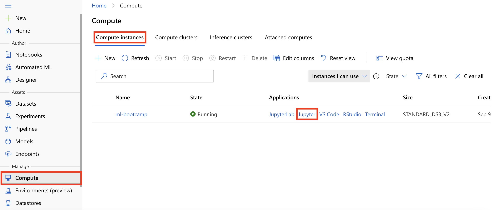

# Hands-on lab: Training and deploying a model in AML

**Contents**

<!-- TOC -->

- [Hands-on lab: Training and deploying a model in AML](#hands-on-lab-training-and-deploying-a-model-in-aml)
  - [Lab Overview](#lab-overview)
  - [Prerequisites](#prerequisites)
  - [Exercise 1: Training and deploying a model in AML](#exercise-1-training-and-deploying-a-model-in-aml)
    - [Task 1: Open Lab Notebook](#task-1-open-lab-notebook)
    - [Task 2: Execute Notebook](#task-2-execute-notebook)

## Lab Overview

In this lab, we will be using a subset of NYC Taxi & Limousine Commission - green taxi trip records available from [Azure Open Datasets](https://azure.microsoft.com/en-us/services/open-datasets/). The data is enriched with holiday and weather data. We will use data transformations and the GradientBoostingRegressor algorithm from the scikit-learn library to train a regression model to predict taxi fares in New York City based on input features such as, number of passengers, trip distance, datetime, holiday information and weather information.

The primary goal of this lab is to learn how to leverage Azure Machine Learning (AML) to provision compute resources to train machine learning models, and then deploy the trained models either to a managed Azure Container Instance (ACI) or to a containerized platform such as Azure Kubernetes Services (AKS).

## Prerequisites

- Knowledge of Python
- Knowledge of training machine learning models using frameworks such as [scikit-learn](https://scikit-learn.org/)

## Exercise 1: Training and deploying a model in AML

### Task 1: Open Lab Notebook

1. On the Machine Learning blade in the [Azure portal](https://portal.azure.com/), open Azure Machine Learning studio by selecting **Launch studio** from the center section of the screen.

   

2. From within Azure Machine Learning studio navigate to **Compute, Compute instances**, and then select **Jupyter** link to open Jupyter Notebooks interface for the compute instance **ml-bootcamp-SUFFIX**.

   

3. Check **Yes, I understand** and select **Continue** in the trusted code dialog.

   

4. From within Jupyter Notebooks interface navigate to `users/odl_user_xxxxxx/day-01/notebooks`.

5. Open `Lab01 - Training and deploying a model in AML`. This is the Python notebook you will step through executing in this lab.

### Task 2: Execute Notebook

1. Follow the instructions within the notebook, `Lab01 - Training and deploying a model in AML`, to complete the lab.
